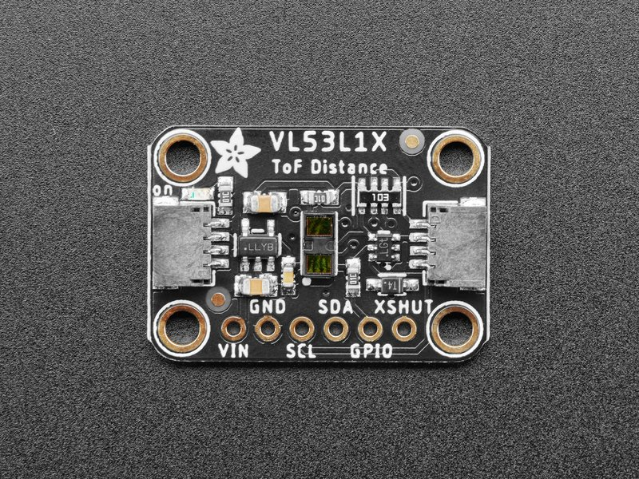

# VL53L1X - distance sensor

The VL53L1X is a state-of-the-art, Time-of-Flight (ToF), laser-ranging sensor. It is the fastest miniature ToF sensor on the market with accurate ranging up to 4 m and fast ranging frequency up to 50 Hz housed in a miniature and reflowable package, it integrates a SPAD receiving array, a 940 nm invisible Class1 laser emitter, physical infrared filters, and optics to achieve the best ranging performance in various ambient lighting conditions with a range of cover window options.
Unlike conventional IR sensors, the VL53L1X uses ST’s latest generation ToF technology which allows absolute distance measurement whatever the target color and reflectance.
It is also possible to program the size of the ROI on the receiving array, allowing the sensor FoV to be reduced

## Documentation

**VL53L1X** [datasheet](https://www.st.com/en/embedded-software/stsw-img007.html)

You will find this device for example as ["Adafruit VL53L1X Time of Flight Distance Sensor - ~30 to 4000mm"](https://www.adafruit.com/product/3967)

## Board



## Usage

All calibration and all setup of the sensor is done fully transparently for you. Just create a class and start reading the distance.
Make sure you have turned the device on via the xShut pin.

```csharp
using Vl53L1X vl53L1X = new(I2cDevice.Create(new I2cConnectionSettings(1, Vl53L1X.DefaultI2cAddress)));

Console.WriteLine($"SensorID: {vl53L1X.SensorId:X}");
vl53L1X.Precision = Precision.Short;

while (!Console.KeyAvailable)
{
   try
   {
       Console.WriteLine($"Distance: {vl53L1X.Distance.Millimeters}");
       Console.WriteLine($"RangeStatus {vl53L1X.RangeStatus}");
   }
   catch (Exception ex)
   {
      Console.WriteLine($"Exception: {ex.Message}");
   }

   Thread.Sleep(500);
}

```
