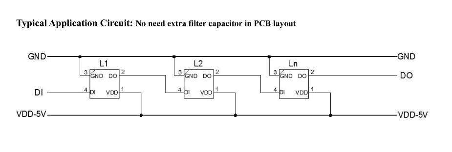
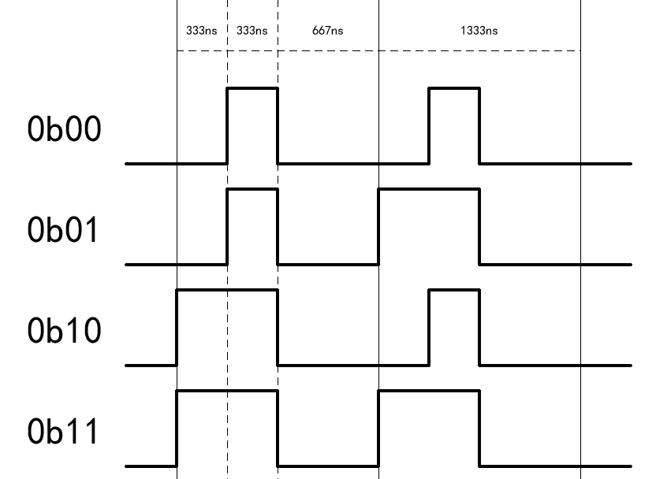

# WS2812B - Intelligent control LED integrated light source

WS2812B is a intelligent control LED light source that the control circuit and RGB chip are integrated in a package of 5050 components.

It internal include intelligent digital port data latch and signal reshaping amplification drive circuit.

Also include a precision internal oscillator and a voltage programmable constant current control part, effectively ensuring the pixel point light color height consistent.

## Documentation

- [Introduce](http://www.world-semi.com/Certifications/WS2812B.html)
- [Datasheet](http://www.world-semi.com/DownLoadFile/108)

## Typical application circuit



## SPI MOSI Timing



## Usage

Here is an example how to use the WS2812B:

```csharp
using System;
using System.Device.Spi;
using System.Drawing;
using System.Threading;
using Iot.Device.Ws2812b;

var random = new Random();

using SpiDevice spiDevice = SpiDevice.Create(new SpiConnectionSettings(0, 0)
{
    ClockFrequency = Ws2812b.SpiClockFrequency
});
using Ws2812b ws2812b = new Ws2812b(spiDevice, 16);

while (true)
{
    for (var i = 0; i < ws2812b.Pixels.Length; i++)
    {
        ws2812b.Pixels[i] = Color.FromArgb(255, random.Next(256), random.Next(256), random.Next(256));
    }

    ws2812b.Flush();
    Thread.Sleep(1000);
}

```
