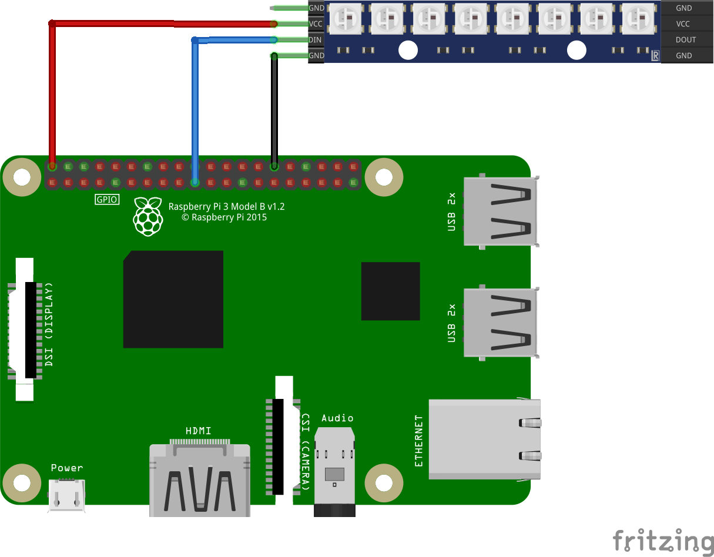
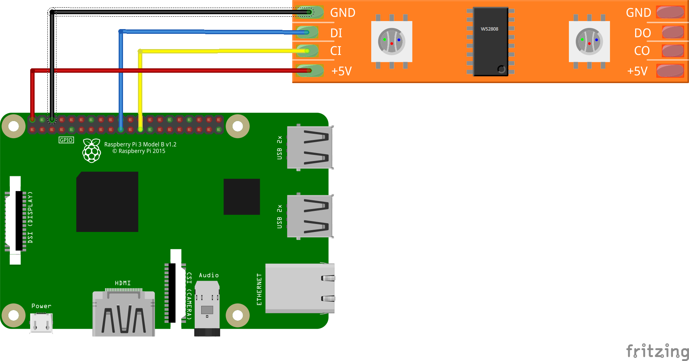

# Drive Neo pixel strip (x8) from Raspberry Pi

This [program](Ws28xx.Sample.cs) demonstrates how to use the [Neo pixel binding](../Ws28xx.cs) to drive an 8 Neo Pixel stick from a Raspberry Pi.

It shows how to set the colors of each LED using `SetPixel` and `Update`. Then it shows how to fade in one of the LEDs in a loop.

## Run the sample

Please build the samples project with configuration key depending on connected devices:

For WS2812b connection you don't have to use any configuration keys. Example:
```console
dotnet publish -o C:\DeviceTester -r linux-arm
```

For WS2808 driver use WS2808 key. 
Example:
```console
dotnet publish -c WS2808 -o C:\DeviceTester -r linux-arm
```

## Breadboard layout for WS2812b

The following [fritzing diagram](rpi-neo-pixels.fzz) demonstrates how you should wire your device in order to run the program. It uses the GND, 5V and MOSI pins on the Raspberry Pi.



## Breadboard layout for WS2808

It uses the GND, 5V, MOSI and SCLK pins on the Raspberry Pi.



## Hardware elements

The following elements are used in this sample:

* [Raspberry Pi 3](https://www.adafruit.com/product/3055)
* [Neo pixels x8 stick](https://www.adafruit.com/product/1426)
