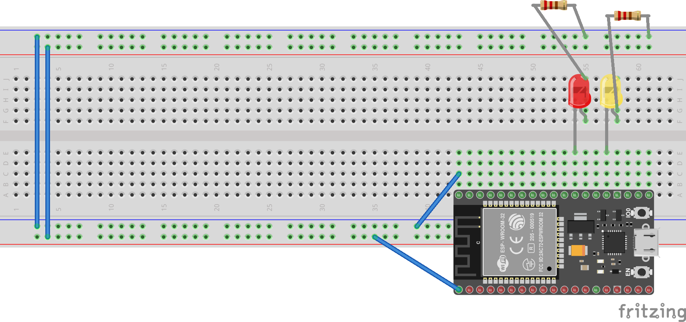

# ArduinoCsCompiler

This tool allows to compile a .NET assembly into a form that can be executed on microcontrollers with limited storage and RAM. You can test and debug your application on the PC and then transfer it to a supported microcontroller (MCU). Once the application has been loaded to the MCU, a connection to the PC is no longer necessary and the program runs independently. Read on for instructions to get started.

At the moment, the following microcontrollers are supported:

- ESP32

- Arduino Due (with some limitations, see below)

Additionally, the microcontroler can be simulated on the PC for additional testing and debugging possibilities.

This tool is in an experimental phase. Behavior and features may still significantly change.

## Overview

To execute .NET code, the microcontroler needs to be programmed with a firmware that is able to understand the IL (Intermediate language) code generated by the C# (or VB) compiler. We call this part the "Firmware". It is loaded using tools supplied from the microcontroler vendors. For compiling and uploading, the instructions use the Arduino command line interface. The Arduino IDE can also be used after some initial steps.

After the firmware has been loaded, the compiler can talk to the microcontroler and upload program code. The program will start executing right after the upload or after the microcontroler has been reset.

## Step-by-Step instructions

### Building the compiler

Enter the checkout directory where you have checked out the dotnet/iot repository, e.g. `C:\projects\iot` and run `build.cmd`. That builds all the projects in the solution and downloads any dependent packages. The ArduinoCsCompiler executable will be built to `C:\projects\iot\tools\ArduinoCsCompiler\Frontend\bin\Debug\net6.0`. So run `cd tools\ArduinoCsCompiler\Frontend\bin\Debug\net6.0`. Now

> `acs --help`

should give an output like

```text
ArduinoCsCompiler - Version 1.0.0.0
The .NET Foundation
compile    Compile and optionally upload code to a microcontroller. Further options allow to debug the uploaded code.
prepare    Prepare the Arduino runtime for uploading
test       Run various interactive tests on the board
help       Display more information on a specific command.
version    Display version information.
```

### Preparing the microcontroler

These instructions assume your microcontroler is any type of ESP32 board, the Arduino Due requires some additional prerequisites and considerations outlined below.

These instructions assume you have Visual Studio 2022 installed and a git installation available. Open a "developer command prompt for VS2022" as administrator from the start menu. Some of the following steps are also available from the "Board Manager" and "Library Manager" windows in the Arduino IDE if it is installed. However, the use of the command line is less error-prone for getting everything together for the first time.

Test you have chocolatey installed (the Windows package manager).

> `choco --version`

If this returns an error instead of printing a version number, install it:

> `powershell -ExecutionPolicy Bypass; [System.Net.ServicePointManager]::SecurityProtocol = [System.Net.ServicePointManager]::SecurityProtocol -bor 3072; iex ((New-Object System.Net.WebClient).DownloadString('https://community.chocolatey.org/install.ps1'))`

Install the Arduino Command line utility (can be installed alongside the Arduino IDE)

> `choco install arduino-cli`

If running for the first time, initialize the configuration and download the ESP32 toolchain (compiler + tools)

> `arduino-cli config init`
> `arduino-cli config add board_manager.additional_urls https://raw.githubusercontent.com/espressif/arduino-esp32/gh-pages/package_esp32_dev_index.json`
> `arduino-cli core update-index`
> `arduino-cli core install esp32:esp32`

It is recommended to use the 2.0.x version of the ESP toolchain (as done above), particularly when WIFI shall be used, because the performance of some operations have been significantly improved. The 1.X version can also be used with some minor code modifications.

Now we are ready to download and install the actual code. Some required libraries:

> `arduino-cli lib install "DHT sensor library"`
> `arduino-cli lib install "Servo"`

The firmata code (protocol and hardware support) as well as the IL execution engine (where %ArduinoRoot% is typically `C:\Users\<your name>\Documents\Arduino`). Due to the way the Arduino library management works, you cannot use a different checkout directory.

> `git clone https://github.com/firmata/ConfigurableFirmata %ArduinoRootDir%\libraries\ConfigurableFirmata`
> `git clone https://github.com/pgrawehr/ExtendedConfigurableFirmata %ArduinoRootDir%\ExtendedConfigurableFirmata`

Before we can finally build the firmware, we need to generate the interface declarations for it. This alligns some important constants between the compiler and the runtime. Switch to the compiler directory `C:\projects\iot\tools\ArduinoCsCompiler\Frontend\bin\Debug\net6.0` and execute:

> `acs prepare --flashsize 4MiB`

To finally compile the firmware, switch to `%ArduinoRootDir%\ExtendedConfigurableFirmata` and execute

> `arduino-cli compile --fqbn esp32:esp32:esp32:PSRAM=disabled,PartitionScheme=default,CPUFreq=240,FlashMode=qio,FlashFreq=80,FlashSize=4M,UploadSpeed=921600,DebugLevel=none ./ExtendedConfigurableFirmata.ino --warnings default`
> `arduino-cli upload --fqbn espressif:esp32:esp32:PSRAM=disabled,PartitionScheme=default,CPUFreq=240,FlashMode=qio,FlashFreq=80,FlashSize=4M,UploadSpeed=921600,DebugLevel=none ./ExtendedConfigurableFirmata.ino --verbose -p COM4`

Your particular board may require different settings. The valid settings can be seen in the tools menu of the Arduino IDE. If you open `ExtendedConfigurableFirmata.ino` in the IDE, the above steps are performed automatically if you hit the "Upload" button. The IDE has a big list of detailed board types that affect the amount of memory that is available (check the list under Tools->Board->ESP32).

> Note: Because we previously wrote a custom flash partition file using `acs prepare --flashsize xxx` with the partitions required for the firmware, the IDE setting "Partition Scheme" has no effect. After a successful compile, the compiler will give a message such as `The sketch uses 930973 bytes (71%) of program memory. The maximum is 1310720 Bytes.` **This message is incorrect**. The maximum value indicated comes from the "Partition scheme" selection, while the relevant maximum is the size of the `factory` partition, which can be specified by giving the `--firmwaresize` parameter to the `acs prepare` command (default is 1MiB). If the `factory` partition is smaller than the actual firmware, you might still be able to upload it, but the behavior is undefined. Typically the ESP32 will not boot successfully.

By default, the Firmware is configured to use the USB connection for communication and software upload. If you edit `ExtendedConfigurableFirmata.ino` you can enable WIFI. This might improve upload speed and allows the ESP32 to use the internet to synchronize its system clock. If WIFI is enabled, the data partition on the Flash storage is accessible using FTP.

### Write and test your program

There are sample programs available to start coding. In the samples folder, you might want to start out with the `BlinkingLed` sample. It simply blinks a LED on GPIO 16. The LED on GPIO2 is used by the firmware to indicate the current execution status.



When you start the program in Visual Studio, use the startup profile settings to indicate how the board is connected. Use

> `BlinkingLed.exe COM4`

if the board is connected via USB to COM4 (and WIFI is not active). If WIFI is active, use

> `BlinkingLed.exe INET <IP-Address>`

You can get the IP address the ESP32 retrieves via DHCP by looking at the output on the serial console when the firmware boots. You might want to set the configuration option "Core Debug Level" in the "Tools" Menu to "Verbose" (you need to re-flash the firmware after that setting changes).

You can now test and debug your application.

### Upload the C# program to the MCU

Finally, when you think your application works as it should, the ArduinoCsCompiler will prepare and transfer it to the microcontroller, so that it can be executed standalone, without the need for the PC. Of course, if you used the USB cable to power the MCU, you still need to provide a power source, e.g. a portable USB battery pack.

> `acs compile -p COM5 BlinkingLed.exe`

This command takes your program, strips all unnecessary metadata (such as method names) from it and transfers to the MCU. If you don't get any errors or warnings, the program should start executing automatically. Any debug messages will be printed to the console. If you add the `--debug` switch the compiler will stop at the first instruction of the main method and wait for input. You can then use the command line to single-step trough the code. Debugging will be at IL level now, so you might want to use a tool like `ildasm` or Resharpers dotpeek to compare that to the source code you have written, in case something goes wrong.

## The Arduino Runtime and its limits

The microcontroller has very limited memory, therefore some compromises are required to get the relevant parts of the .NET runtime onto these tiny chips. The ArduinoCsCompiler is still in an experimental phase and many features where just left out for later. Many C# functions that access the hardware (particularly related to disk I/O and networking) are just missing. Some of these issues are under development, however we can't make promisses when or if they will be available.

- If WIFI is disabled, calls to `DateTime.UtcNow` and `DateTime.Now` will return a constant. It is possible to attach an external real-time-clock, though.
- Only one culture is supported at a time. The compiler switch `-c` can be used to specify the culture to use (default is the current culture). This will affect number formatting as well as printing of date and time strings.
- Only a single thread can run at once. Starting threads and tasks is not supported.
- SPI and PWM drivers are not available. (I2C works, and so should any binding that uses I2C communication)
- The garbage collector of the runtime uses a very simplistic algorithm that could lead to memory exhaustion even though there would still be enough free blocks.
- Exceptions handling mostly works, however some system errors might not return meaningful error messages.

## Notes on the use of the Arduino Due

The firmware supports the Arduino Due, but since its memory (512k Flash, 96k RAM) is much smaller than that of the ESP32 some extra effort may be necessary to reduce the code size so that it fits the available flash space. Check out the compiler option `--suppress`. Due to a [known bug in the Arduino Due's standard library](https://arduino.stackexchange.com/questions/80535/memory-allocation-on-arduino-due-never-returns-null), you need to patch the standard library before you use it to compile the firmware for this board. Otherwise, when the runtime runs out of memory, the Due will just crash and stop responding.

Locate the file `C:\Users\Patrick\AppData\Local\Arduino15\packages\arduino\hardware\sam\1.6.12\cores\arduino\syscalls_sam3.c` (if it's not there, you need to install the Arduino Due Toolchain first using the library manager).

Replace the function `_sbrk` with this code:

```c
size_t __malloc_margin = 2 * (size_t)1024;

extern caddr_t _sbrk (int incr) {
    static const unsigned char *       heap      = (unsigned char *)&_end ;
    /****/ const unsigned char * const prev_heap = heap;

    if (incr > 0) {
        // Extra checks for stack growing

        unsigned char *stack_ptr;

        asm volatile(
            "mov %[sp_out], sp"
            : [sp_out] "=r" (stack_ptr)
            :
        );

        if (stack_ptr < heap) {
            // We're already in real trouble.
            abort();
        }

        if (stack_ptr - heap  <  incr + __malloc_margin) {
            // Not enough memory considering safety margin.
            errno = ENOMEM;
            return (caddr_t)-1;
        }
    }

    heap      += incr ;
    return (caddr_t) prev_heap ;
}
```

## Compiler Diagnostics

This is an incomplete list of error and warning messages from the Arduino Compiler (ACS).
Note that the compiler will not output source file information, since it operates directly on the binary file. It only "knows" of methods and classes.

ACS0001: Internal compiler error
: Instead of this error, you'll probably get an exception.

ACS0002: This compiler is currently supported on Windows only. The target CPU may be anything, but the compiler is only tested on Windows. You might experience build or runtime failures otherwise.
: The Arduino Compiler is currently only supported on windows. The runtime replicates parts of the low-level system calls, and hence depends on the operating system the compiler runs on.

ACS0003: Could not find file {FileName}. (Looking at absolute path {Path})
: The input file could not be found.

ACS0004, {methodInfo.MethodSignature()} has no visible implementation
: The given low-level method is not implemented in the runtime. If the method is actually used in the program, a run-time error will occur.

ACS0006, Method {methodInfo.MemberInfoSignature()} has [MethodImpl(MethodImplAttributes.Synchronized)] and is static. This is not supported.
: Don't use `[MethodImpl(MethodImplAttributes.Synchronized)]` on static methods (and generally, by the way).

ACS0007: Should have a replacement for {original.MethodSignature()}, but it is missing. Caller: {callingMethod.MethodSignature()}. Original implementation is in {original.DeclaringType!.AssemblyQualifiedName}
: This error means that the Arduino Runtime is missing a required replacement method. A replacement method is a low-level call that needs to be provided by the firmware (because the original method doesn't work on the microcontroller)
